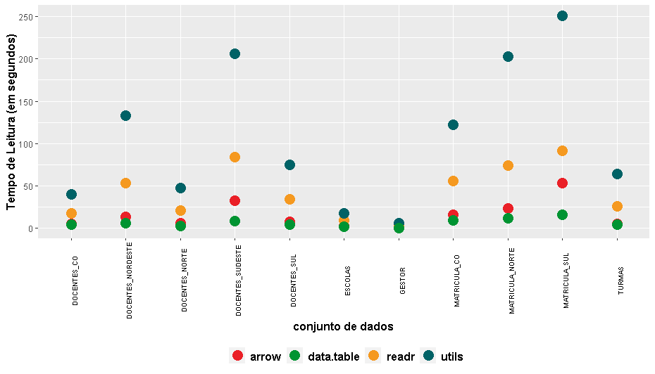
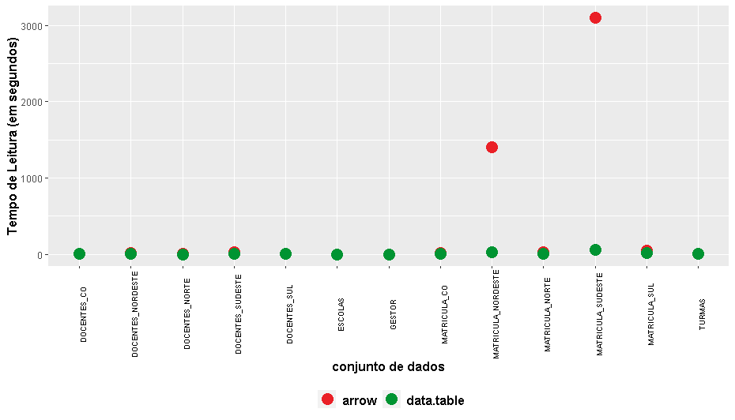

<style>
body {
text-align: justify}
</style>

Já se passaram décadas após a criação do `csv`, mas ainda é rotina entre as intituições, seja no setor privado, seja nas instituições públicas, armazenar dados em um arquivo `csv` (“comma-separated-values”), que como próprio significado da sigla já diz, é um arquivo com valores separados por vírgulas. Vale ressaltar que, como no Brasil a vírgula é utilizada como separador de casa decimal, então é prática comum utilizar o sinal ponto e vírgula (;) como separador de valores, em vez de usar o sinal vírgula. Também, pode-se utilizar outro caractere como separador de colunas, e, assim o `csv` passa a ser chamado por alguns como "character-separated-values".

A maioria dos softwares e aplicativos tem suporte para leitura e gravação de arquivos csv, pois este é um formato de arquivo bastante difundido e de fácil manipulação (a depender do tamanho do arquivo, é possível abrir em um bloco de notas, fazer uma leitura humana, e inclusive editar o arquivo de dados csv). 

No `csv`, cada linha representa um registro, e os valores dos campos associados a esses registros são separados por vírgula (ou ponto e vírgula ou outro caractere). Por exemplo, suponha que seja de interesse, armazenar em um arquivo `csv` com informações básicas das últimas 5 copas do mundo de futebol masculino da FIFA. Para tanto, bastaria abrir um bloco de notas, digitar o texto abaixo e depois salvar com a extensão `.csv`:

```
sede,campeão,ano
Rússia,França,2018
Brasil,Alemanha,2014
África do Sul,Espanha,2010
Alemanha,Itália,2006
Coréia do Sul e Japão,Brasil,2002

```
Porém, apesar das diversas vantagens, quando o número de registros e de campos aumentam de forma considerável, a leitura desses arquivos passam a ter custo computacional elevado, pois o `csv` é um arquivo “row oriented dataset” (ou ainda chamado também de “row storage”), ou seja, como o próprio nome define, é um conjunto de dados orientados a linha, e assim, a leitura do arquivo é feito linha a linha. Portanto, mesmo que o interesse de análise seja de uma ou de algumas colunas específicas, todas as colunas serão lidas, diminuindo assim a performance. 

Então, o formato de arquivos Apache parquet, que é um "column oriented dataset”, ou seja, conjunto de dados orientado a colunas, se torna uma excelente alternativa ao `.csv` para gravar grandes conjuntos de dados para análise, pois, além de leitura mais rápida, a taxa de compressão desses arquivos é muito maior em relação aos `.csv` ocupando menos espaço em disco.

De acordo com o site do projeto (https://parquet.apache.org/): *"Apache Parquet is a columnar storage format available to any project in the Hadoop ecosystem, regardless of the choice of data processing framework, data model or programming language"*, ou seja, é um formato de armazenamento colunar, disponível para qualquer projeto do ecossistema Hadoop, independente da escolha da estrutura de processamento dos dados, do modelo dos dados ou da linguagem de progamação.

## O conjunto de dados de exemplo

Vamos utilizar como exemplo, dados do censo escolar 2019, realizado pelo Ministério da Educação do Brasil. Os microdados, são disponibilizados para download no site do INEP - Instituto Nacional de Estudos e Pesquisas Educacionais Anísio Teixeira.

O download é de um arquivo `microdados_educacao_basica_2019` compactado com extensão `.zip`, cujo conteúdo é uma pasta `microdados_educacao_basica_2019` contendo quatro outras pastas `ANEXOS`, `DADOS`, `FILTROS`, `LEIA-ME`. 

Na pasta `DADOS` existem 15 conjuntos de dados em formato `.csv`.

Esses conjuntos de dados são relativamente massivos. Por exemplo, o arquivo `MATRICULA_NORDESTE.CSV` que é o conjunto de dados com informações de cada aluno matriculado na educação básica em escolas do Nordeste do Brasil, possui 15.304.589 registros e 103 campos, e, ocupa em disco 3.790.278 KB, ou seja  quase 3,8 Gigabytes.

## O equipamento

Para os testes de performance de leitura e escrita de arquivos `csv` e `parquet` apresentados aqui neste post, foi utilizado um notebook Lenovo, com processador intel core i7-4500U quad-core, , 16Gb de memória RAM e HD com capacidade de 1 Tb.

## Apache Arrow

A Apache Foundation tem mantido o projeto Arrow, que de acordo com o site do projeto (https://arrow.apache.org/): *"A cross-language development platform for in-memory analytics"*. De forma geral, poderiamos dizer que o Arrow é uma framework para desenvolver aplicações que processam e transportam grandes conjuntos de dados. O Apache Arrow ajuda a melhorar desempenho de algoritmos analíticos e dá eficiência na movimentação de dados de uma sistema (ou linguagem de programação) para outra.

Felizmente, existe uma biblioteca do Apache Arrow no R, de nome `arrow`, que dentre várias funcionalidades, fornece funções de fácil utilização, para leitura e escrita de arquivos de diversos formatos, incluindo `csv` e no formato `parquet`. Para ter acesso a essas funções, primeiro instale a biblioteca `arrow`:

``` {.r}
install.packages("arrow")
```

## Carregando os arquivos `csv` no ambiente R

Com a biblioteca `arrow` já devidamente instalada, para ler os microdados do Censo Escolar 2019, que estão no formato `csv`, e que tem o caracter pipe (`|`) como separador de colunas, basta utilizar a função `read_delim_arrow()` da biblioteca `arrow`:


``` {.r}
matricula_NE <- arrow::read_delim_arrow(
  file = "./microdados_educacao_basica_2019/DADOS/DOCENTES_CO.CSV",
  delim = "|"
)
```

A leitura do arquivo `DOCENTES_CO.CSV`, que possui 892.665 registros e 136 campos, e ocupa em disco algo entorno de 268 Mb,  levou 5,37 segundos para ser lido. Segue abaixo algumas estatísticas relacionadas aos datasets do censo escolar disponibilizados pelo INEP, incluindo o tempo de carregamento no ambiente R.

Tabela 1. Informações sobre leituras de arquivos do Censo escolar 2019 no formato `csv` com uso da biblioteca `arrow` no R.

dataset            |  registros | campos | tamanho (KB) | tempo de leitura  (segundos)
------------------ |   -------: | :----: | ----------: | ---------------:
DOCENTES_CO        |    892.665 | 136    |   285.874   |     5,37
DOCENTES_NORDESTE  |  3.044.057 | 136    |   964.596   |    16,75
DOCENTES_NORTE     |  1.067.901 | 136    |   341.999   |     6,56
DOCENTES_SUDESTE   |  4.653.852 | 136    | 1.478.987   |    46,21
DOCENTES_SUL       |  1.879.896 | 136    |   600.905   |    11,08
ESCOLAS            |    228.521 | 234    |   108.590   |      2,50
GESTOR             |    187.740 |  83    |    41.668   |     1,61
TURMAS             |  2.432.438 |  79    |   450.988   |     7,42
MATRICULA_CO       |  3.945.797 | 103    |   975.562   |    19,04
MATRICULA_NORDESTE | 15.304.589 | 103    | 3.790.278   | 1.810,51
MATRICULA_NORTE    |  5.198.366 | 103    | 1.289.161   |    31,73
MATRICULA_SUDESTE  | 19.785.845 | 103    | 4.803.374   | 3.103,85
MATRICULA_SUL      |  6.932.126 | 103    | 1.703.439   |    56,18

## Salvando dados em arquivos Parquet com Apache Arrow no R

Com o conjunto de dados já carregado no ambiente R, para gravar este dataframe disponível em memória em um arquivo parquet no disco, passe como argumento `x` da função `write_parquet()` o nome do dataframe que deseja salvar, e no argumento `sink` o diretório e o nome do arquivo parquet:

``` {.r}
arrow::write_parquet( 
  x = matricula_NE,
  sink = "./microdados_educacao_basica_2019/DADOS/MATRICULA_NORDESTE.parquet"
)
```

Por exempplo, para o arquivo `MATRICULA_NORDESTE.CSV`, O R demorou 1.227,41 segundos para gravar o dataframe em um arquivo parquet no disco, ocupando do disco 323.494 KB. Dado que este conjunto de dados no formato `CSV` ocupava 3.790.278 KB do disco, houve uma redução significativa do tamanho na ordem de 66,8%.

Segue abaixo algumas estatísticas relacionadas a gravação em disco de dataframe em formato parquet: 

Tabela 2. Informações sobre escritas de arquivos do Censo escolar 2019 no formato `parquet` com uso da biblioteca `arrow` no R.

dataset           | registros | campos | tamanho do csv (KB) | tamanho do parquet (KB) | Compressão | tempo de gravação (segundos)
------------------ | ---------:| :----: | ----------: | ---------:| :------: | -------:
DOCENTES_CO        |    892.665 | 136    |   285.874  |    31.213 | 89,1%    |     4,91
DOCENTES_NORDESTE  |  3.044.057 | 136    |   964.596  |   122.796 | 87,3%    |    15,16
DOCENTES_NORTE     |  1.067.901 | 136    |   341.999  |    41.464 | 87,9%    |     5,89
DOCENTES_SUDESTE   |  4.653.852 | 136    | 1.478.987  |   151.313 | 89,8%    |    24,14
DOCENTES_SUL       |  1.879.896 | 136    |   600.905  |    78.500 | 86,9%    |    11,20
ESCOLAS            |    228.521 | 234    |   108.590  |    16.943 | 84,4%    |     9,63
GESTOR             |    187.740 |  83    |    41.668  |    10.341 | 75,2%    |     3,39
TURMAS             |  2.432.438 |  79    |   450.988  |    66.316 | 85,3%    |     8,54
MATRICULA_CO       |  3.945.797 | 103    |   975.562  |   323.494 | 66,8%    |    20,43
MATRICULA_NORDESTE | 15.304.589 | 103    | 3.790.278  |   916.171 | 75,8%    |   255,61
MATRICULA_NORTE    |  5.198.366 | 103    | 1.289.161  |   315.049 | 75,6%    |    17,50
MATRICULA_SUDESTE  | 19.785.845 | 103    | 4.803.374  | 1.146.767 | 76,1%    | 1.389,93
MATRICULA_SUL      |  6.932.126 | 103    | 1.703.439  |   409.738 | 75,9%    |    24,07

## Lendo arquivos Parquet com Apache Arrow no R

Agora, se deseja ler um arquivo parquet salvo em disco, passe como argumento `file` da função `read_parquet()` o diretório e o nome do arquivo parquet:

``` {.r}
matricula_NE_Parquet <- arrow::read_parquet(
  file = "./microdados_educacao_basica_2019/DADOS/MATRICULA_NORDESTE.parquet"
)
```

Segue abaixo algumas estatísticas relacionadas a leituras dos datasets do censo escolar 2019 salvos em formato parquet, comparando com os gravados em csv:

Tabela 3. Informações sobre leituras de arquivos do Censo escolar 2019 no formato `parquet` com uso da biblioteca `arrow` no R.

dataset           | registros | campos | tempo de leitura do csv  (segundos) | tempo de leitura do parquet  (segundos) | Tempo de Leitura CSV / Tempo de Leitura Parquet
------------------ | -------: | :----: | ----------: | -------: | -------:
DOCENTES_CO        |    892.665 | 136  |     5,37    |   2,87   |   1,9
DOCENTES_NORDESTE  |  3.044.057 | 136  |    16,75    |   8,14   |   2,1  
DOCENTES_NORTE     |  1.067.901 | 136  |     6,56    |   3,79   |   1,7
DOCENTES_SUDESTE   |  4.653.852 | 136  |    46,21    |  11,18   |   4,1
DOCENTES_SUL       |  1.879.896 | 136  |    11,08    |   6,04   |   1,8
ESCOLAS            |    228.521 | 234  |     2,50    |   2,11   |   1,2
GESTOR             |    187.740 |  83  |     1,61    |   1,51   |   1,1
TURMAS             |  2.432.438 |  79  |     7,42    |   6,41   |   1,2
MATRICULA_CO       |  3.945.797 | 103  |    19,04    |  14,19   |   1,3
MATRICULA_NORDESTE | 15.304.589 | 103  | 1.810,51    |  63,77   |  28,4
MATRICULA_NORTE    |  5.198.366 | 103  |    31,73    |  14,70   |   2,2
MATRICULA_SUDESTE  | 19.785.845 | 103  | 3.103,85    | 109,02   |  28,5
MATRICULA_SUL      |  6.932.126 | 103  |    56,18    |  16,44   |   3,4

Vale ressaltar que, se for de interesse ler somente algumas colunas do conjunto de dados, ao usar a função `read_parquet`da biblioteca `arrow`, basta incluir o argumento `col_select` e passar para ele um vetor com os nomes das colunas que deseja ler. Esse argumento também suporta as funções auxiliares de seleção de atributos da função `select`da biblioteca `dplyr` como a `starts_with()`, `ends_with()`, `contains()`, `matches()`, etc.


## Considerações importantes

Ao comparar conjuntos de dados identicos salvos em formatos diferentes (`csv` e `parquet`), percebe-se (vide tabela 2) que os arquivos `parquet` consomem muito menos espaços em disco, visto que os arquivos de armazenamento orientados a colunas tem taxa de compressão maiores do que os orientados a linhas. Isso traz uma vantagem imensa em armazenar dados em formatos `parquet` pois o custo cai significativamente. Pela comparação dos 15 conjuntos de dados do Censo Escolar 2019, verificamos redução média de 81,2% comparando o tamanho de arquivos `parquet`em relação ao formato `csv`.

Outro fato que chama atenção é que, mesmo quando se tem conjunto de dados com os mesmo registros e colunas  porém salvos em formato diferentes, a leitura de arquivos parquet é mais rápida que de arquivos csv, este último chegando a ter leitura 28 vezes mais demorada, sendo que na maioria das vezes demora em média o dobro do tempo de leitura.

Ainda, vale destacar que para tarefas, onde na maioria das vezes não são utilizadas todas as colunas do conjunto de dados para conduzir uma análise, o fato do parquet ser um formato de arquivo orientado a colunas, pode ser lido somente as colunas de interesse, diminuindo assim o tempo de leitura do arquivo, bem como consumindo menos recursos computacional, levando novamente vantagem em relação ao `csv` que teria que varrer todo o conjunto de dados para depois manter somente as colunas de interesse, resultando em gasto de tempo e de recurso computacional.

## Bônus - Carregando os arquivos `csv` no ambiente R com outras bibliotecas

Além da `arrow`, que possui a ``read_delim_arrow`, outras biblioteca também disponibilizam funções para leituras de arquivos `csv`. O próprio R Base tem a função `read.delim()` (da biblioteca `utils`) para ler arquivos no formato de valores separados por caracter, conforme script abaixo:

``` {.r}
matricula_NE <- utils::read.delim(
  file = "./microdados_educacao_basica_2019/DADOS/DOCENTES_CO.CSV",
  delim = "|"
)
```

Na biblioteca `readr` do Tidyverse tem a a função `read_delim()` para ler arquivos csv:

``` {.r}
matricula_NE <- readr::read_delim(
  file = "./microdados_educacao_basica_2019/DADOS/DOCENTES_CO.CSV",
  delim = "|"
)
```

Já a biblioteca `data.table` oferece a função `fread()` para ler arquivos csv:

``` {.r}
matricula_NE <- data.table::fread(
  file = "./microdados_educacao_basica_2019/DADOS/DOCENTES_CO.CSV",
  sep = "|"
)
```

Tabela 4. Tempo de leitura (em segundos) de arquivos do Censo escolar 2019 no formato `csv` de acordo com algumas biblioteca do R.

dataset            |   arrow  |   readr  |   utils   | data.table  
------------------ | -------: | -------: | -------: |   -------: 
DOCENTES_CO        |     5,37 |   17,97  |    40,13 |      4,23 
DOCENTES_NORDESTE  |    14,04 |   53,79  |   133,05 |      6,17       
DOCENTES_NORTE     |     6,37 |   21,31  |    47,90 |      2,85      
DOCENTES_SUDESTE   |    33,08 |   83,83  |   206,15 |      9,10       
DOCENTES_SUL       |     7,97 |   34,14  |    75,37 |      4,72       
ESCOLAS            |     2,66 |    9,18  |    17,53 |      1,74      
GESTOR             |     1,30 |    2,72  |     5,94 |      0,72      
TURMAS             |     5,45 |   26,47  |    64,62 |      4,28      
MATRICULA_CO       |    16,40 |   55,61  |   122,14 |      9,29       
MATRICULA_NORDESTE | 1.407,40 |     -    | 1.747,50 |     30,72        
MATRICULA_NORTE    |    23,89 |   74,22  |   202,72 |     12,21      
MATRICULA_SUDESTE  | 3.103,85 |     -    |      -   |     60,73        
MATRICULA_SUL      |    53,30 |   91,75  |   250,81 |     16,06       

Vale ressaltar que o `readr` não conseguiu ler os arquivos `MATRICULA_NORDESTE` e `MATRICULA_SUDESTE`, justamente os mais massivos, tanto em termos de número de registros, quanto em termos de tamanho em disco. A biblioteca `utils`, do Base do R, não conseguiu ler o `MATRICULA_SUDESTE`, o maior conjunto de dados analisado aqui neste post.

Veja o gráfico a seguir (elaborado em `ggplot2`, claro!) com o tempo de leitura (em segundos) dos microdados do Censo Escolar 2019 em formato csv, realizadas através de funções de quatro bibliotecas diferentes do R. Vale ressaltar que não foram plotados os tempos de leituras dos conjuntos de dados por questões de escala.



Entre as 4 funções comparadas, a `read.delim()` da biblioteca `utils` se destava como a que mais demorou para ler os arquivos nos formatos `csv`, seguida pela `read_delim()` do `readr`. Já a função `read_delim_arrow` apresentou tempo de leitura próximo a da `fread` da biblioteca `data.table`, porém, à medida que o conjunto de dados ia se tornando mais massivo, a performance do `arrow` diminuia significativamente, enquanto o `data.table` se manteve robusto em termos de tempo de leitura dos `csv`.

Veja a seguir comparação somente entre `arrow` e `data.table`, porém agora considerando todos os conjuntos de dados:



Enfim, para este experimento, realizado com os 13 conjuntos de dados do Censo Escolar 2019, o `data.table` foi o campeão em termos de leitura de conjunto de dados separados por caracteres através da função `fread`, pois se manteve performático, mesmo quando o conjuntos era bastante massivo.
