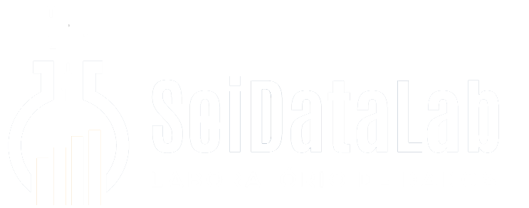
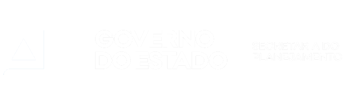
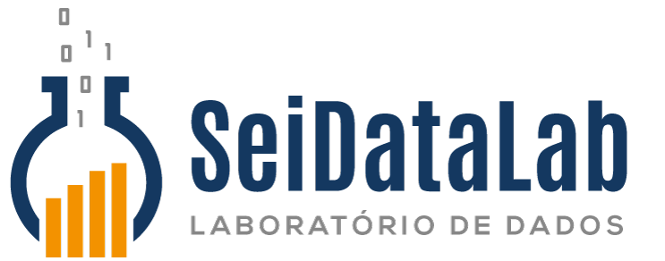

layout: true

<div class="my-footer">



</div>

---
## Modelo de apresentação para o **SEIDataLab**

Modelo de apresentação em `Xaringan` seguindo os layouts e padrão de design da SEI

###Tema da apresentação:

Trocar o nome da apresentação, o nome do apresentador e a data da apresentação por meio dos metadados **YAML** no cabeção do arquivo **.Rmd**

```{}
---
title: "Apresentaçoes SEIDataLab"
subtitle: "Modelo de apresentação"
author: "Rodrigo Cerqueira"
institute: "SEIDataLab - COPESP/DIPEQ/SEI"
date: "26/10/2020 (atualizada: `r Sys.Date()`)"
---

```

---
###Edição:
- Com o comando `xaringan::inf_mr()` é possível visualizar a apresentação em tempo real diretamente do R Studio

- Escrito em RMarkdown

- Cada slide é gerado com a regra horizontal `---`


---
##Tabelas:

Tabelas em R:

- Knitr Kable

```{r}
knitr::kable(x = head(iris), format = "html")
```
---
- DT datatable
```{r}
DT::datatable(iris, 
              fillContainer = FALSE, 
              options = list(pageLength = 4))
```

---
###Expressões matemáticas:

Markdown usa os mesmos padrões do LaTeX para escrita de equações matemáticas:
```{}
$$\bar{X}=\frac{1}{n}\sum_{i=1}^nX_i$$
```
$$\bar{X}=\frac{1}{n}\sum_{i=1}^nX_i$$
---
class: midle

###Gráficos

```{r, out.height= '60%', cache=TRUE, fig.align='center', fig.cap="Legenda"}
library(ggplot2)
ggplot(data=iris, aes(x = Sepal.Length, y = Sepal.Width)) +
  geom_point(aes(color=Species, shape=Species))
```

---
###Figuras/imagens:
Figuras e imagens podem ser inseridas tanto via markdown 
```{}

```

---

Quanto via **chunk** com várias opções de customização

```{r eval=F}
#```{r, out.width='25%, fig.align='center', fig.cap='SEIDataLab Logo'}

#```
```

```{r echo=FALSE, out.width='25%', fig.align="center", fig.cap="SEIDataLab Logo" }

```


